# Global Retail Production Infrastructure Lab


## Project Overview

This project demonstrates the deployment of a production-style infrastructure on Microsoft Azure using the Azure CLI. The environment includes Linux, Windows Server, and Windows 11 virtual machines deployed within a shared virtual network, secured using Network Security Groups (NSGs), configured with web server roles, and validated through end-to-end connectivity testing.

The project emphasizes Infrastructure as Code (IaC) principles by automating resource provisioning through the Azure CLI instead of the Azure Portal. Throughout the deployment, several real-world challenges—including Windows naming constraints, subnet configuration issues, SSH authentication failures, and Azure deployment inconsistencies—were investigated, resolved, and documented.

The completed environment demonstrates secure infrastructure provisioning, operating system configuration, network security, web server deployment, public accessibility validation, and responsible resource cleanup to minimize cloud costs.

---

## Objectives

- Provision Azure infrastructure using the Azure CLI.
- Deploy Linux, Windows Server, and Windows 11 virtual machines.
- Configure a shared Virtual Network (VNet) and subnet for secure communication.
- Deploy a Windows 11 virtual machine within an Availability Zone to improve resilience.
- Install and configure the Nginx web server on Ubuntu Linux.
- Install and configure Internet Information Services (IIS) on Windows Server.
- Configure Network Security Group (NSG) rules to allow secure HTTP access.
- Validate end-to-end public connectivity to both web servers.
- Troubleshoot deployment, networking, and authentication issues encountered during implementation.
- Remove deployed resources after validation to prevent unnecessary Azure charges.

---

## Architecture

The deployed environment consists of a production-style Azure infrastructure with compute, networking, and web services integrated within a shared virtual network.

### Infrastructure Components

- **Resource Group** – Logical container for all Azure resources.
- **Virtual Network (VNet)** – Provides secure communication between deployed virtual machines.
- **Subnet** – Shared subnet hosting all virtual machines.
- **Network Security Groups (NSGs)** – Controls inbound traffic using security rules.
- **Ubuntu Linux Virtual Machine** – Hosts the Nginx web server.
- **Windows Server Virtual Machine** – Hosts the Internet Information Services (IIS) web server.
- **Windows 11 Virtual Machine** – Deployed within an Availability Zone to provide a secure administrative workstation (jump box) for management tasks.
- **Nginx** – High-performance web server running on Ubuntu.
- **Internet Information Services (IIS)** – Microsoft web server running on Windows Server.

---

## Azure Infrastructure

| Resource | Name |
|----------|------|
| Resource Group | `rg-globalretail-prod-001` |
| Region | `West Europe` |
| Linux VM | `vm-linux-web-01` |
| Windows Server VM | `vm-win-admin01` |
| Windows 11 Client VM | `vm-win11-ha` |
| Virtual Network | `vm-linux-web-01VNET` |
| Subnet | `vm-linux-web-01Subnet` |

---

## Technologies Used

### Cloud Platform
- Microsoft Azure
- Azure CLI

### Compute
- Ubuntu Server 22.04 LTS
- Windows Server 2022
- Windows 11 Pro

### Networking
- Azure Virtual Network (VNet)
- Azure Network Security Groups (NSGs)
- Azure Availability Zones

### Web Services
- Nginx
- Internet Information Services (IIS)

### Administration & Connectivity
- Secure Shell (SSH)
- Remote Desktop Protocol (RDP)

---

## Deployment Summary

The Azure environment was provisioned entirely using the Azure CLI, demonstrating an automated approach to infrastructure deployment rather than relying on the Azure Portal.

The implementation included:

- Creating a dedicated Resource Group to organize all Azure resources.
- Deploying an Ubuntu Linux virtual machine to host the Nginx web server.
- Deploying a Windows Server virtual machine to host Internet Information Services (IIS).
- Deploying a Windows 11 client virtual machine within an Availability Zone to provide a resilient administrative workstation.
- Connecting all virtual machines to a shared Virtual Network and subnet.
- Installing and configuring Nginx on Ubuntu.
- Installing and configuring IIS on Windows Server.
- Configuring Network Security Group (NSG) rules to allow inbound HTTP traffic.
- Validating end-to-end public connectivity to both web servers.
- Cleaning up Azure resources after successful validation to prevent unnecessary cloud costs.

---

# Challenges Encountered and Resolutions

Real-world cloud deployments rarely succeed on the first attempt. Throughout this project, several deployment, networking, and authentication issues were encountered and resolved using Azure CLI diagnostics and validation commands.

| Challenge | Investigation & Resolution |
|-----------|----------------------------|
| **VM size availability** | Initial VM deployment was affected by regional SKU availability. After reviewing available VM sizes, a supported SKU (`Standard_D2s_v3`) was selected in the West Europe region. |
| **Azure CLI deployment inconsistency** | Azure CLI returned a `ResourceNotFound` message immediately after deployment. Resource verification using `az vm list` confirmed that the Windows Server VM had actually been created successfully. |
| **Windows computer name limitation** | The initial Windows VM deployment failed because the computer name exceeded the Windows 15-character limit. The VM was renamed to `vm-win-admin01` before redeploying successfully. |
| **Windows 11 subnet conflict** | Azure attempted to create a default subnet, resulting in a subnet conflict. The existing subnet (`vm-linux-web-01Subnet`) was identified and explicitly specified during deployment. |
| **SSH authentication failure** | Initial SSH access returned `Permission denied (publickey)`. Investigation showed that the local machine did not contain an SSH key pair. A new RSA key pair was generated, the public key was associated with the VM, and SSH authentication succeeded. |
| **IIS installation** | Attempting to install IIS from the local PowerShell session failed because the command must be executed inside Windows Server. After connecting via Remote Desktop, IIS was successfully installed using PowerShell running on the VM. |
| **Public HTTP access** | Neither web server was initially reachable because inbound HTTP traffic was not permitted. Network Security Group rules allowing TCP port 80 were created for both virtual machines, after which browser connectivity was successfully verified. |

---
## Troubleshooting & Lessons Learned

### 1. Windows VM Name Constraint

**Issue**

The initial Windows VM deployment failed with the following error:

```text
InvalidParameter

Windows computer name cannot be more than 15 characters long.
```

**Root Cause**

Azure uses the virtual machine name as the Windows computer name by default. Windows computer names are limited to a maximum of 15 characters.

**Resolution**

The VM name was shortened from:

```text
vm-windows-admin-01
```

to:

```text
vm-win-admin01
```

The deployment was then retried successfully.

---

### 2. Azure CLI Returned `ResourceNotFound` After Deployment

**Issue**

After correcting the VM name and rerunning the deployment, Azure CLI returned:

```text
ResourceNotFound
The Resource 'Microsoft.Compute/virtualMachines/vm-win-admin01' was not found.
```

**Investigation**

Rather than assuming the deployment had failed, the deployed virtual machines were verified using:

```bash
az vm list \
  --resource-group rg-globalretail-prod-001 \
  --output table
```

The output confirmed that **vm-win-admin01** had already been created successfully.

**Resolution**

The message appeared to be a temporary Azure deployment reporting inconsistency. Since the resource existed, no further action was required.

**Lesson Learned**

Always verify the actual resource state using commands such as:

```bash
az vm list
```

or

```bash
az resource list
```

instead of relying solely on the immediate deployment response.

---

### 3. Windows 11 Deployment Failed Due to Subnet Conflict

**Issue**

Deploying the Windows 11 virtual machine failed because Azure attempted to create a default subnet that already conflicted with the existing virtual network.

**Investigation**

The existing subnet was identified using:

```bash
az network vnet subnet list \
  --resource-group rg-globalretail-prod-001 \
  --vnet-name vm-linux-web-01VNET \
  --output table
```

The existing subnet:

```text
vm-linux-web-01Subnet
```

was confirmed.

**Resolution**

The deployment command was updated to explicitly use the existing subnet instead of allowing Azure to create a new one.

**Lesson Learned**

When deploying resources into an existing Virtual Network, explicitly specify the subnet to avoid address space conflicts.

---

### 4. SSH Authentication Failed

**Issue**

The initial SSH connection returned:

```text
Permission denied (publickey)
```

**Investigation**

The Linux VM already contained an authorized public key, so the local SSH configuration was inspected:

```bash
ls -la ~/.ssh
```

The directory contained no SSH key pair (`id_rsa` and `id_rsa.pub`).

**Resolution**

A new RSA key pair was generated:

```bash
ssh-keygen -t rsa -b 4096 -f ~/.ssh/id_rsa -N ""
```

The public key was added to the virtual machine, after which SSH authentication succeeded.

**Lesson Learned**

When troubleshooting SSH authentication, verify both the server-side authorized keys and the client-side SSH key pair before assuming the VM configuration is incorrect.

---

### 5. IIS Installation Failed from the Local Machine

**Issue**

Running:

```powershell
Install-WindowsFeature -Name Web-Server -IncludeManagementTools
```

from the local Windows PowerShell session resulted in:

```text
CommandNotFoundException
```

**Root Cause**

The command is available only inside Windows Server and cannot be executed from the local workstation.

**Resolution**

A Remote Desktop (RDP) session was established to the Windows Server VM, PowerShell was opened with administrative privileges, and IIS was successfully installed.

**Lesson Learned**

Always execute operating system–specific administrative commands within the target virtual machine rather than from the local computer.

---

### 6. Public HTTP Access Was Unavailable

**Issue**

Although both web servers were installed successfully, they were not initially accessible through a web browser.

**Investigation**

The existing Network Security Group rules were reviewed and only SSH/RDP access was configured.

**Resolution**

Inbound NSG rules allowing TCP port **80 (HTTP)** were created for both the Linux and Windows virtual machines.

Connectivity was then verified by browsing to both public IP addresses.

**Lesson Learned**

Successful application deployment does not guarantee external connectivity. Network Security Group rules should always be validated when troubleshooting access issues.

# Deployment Walkthrough

## Phase 1 — Resource Group Creation

A dedicated Azure Resource Group was created to logically organize all infrastructure resources for the deployment.

**Screenshots**

### Resource Group Created

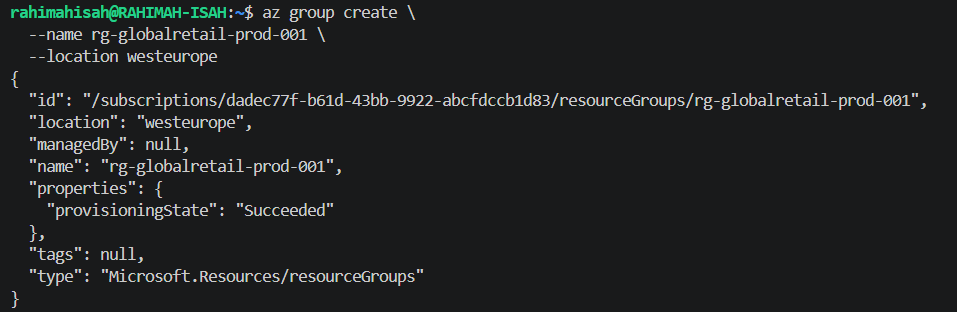

---

## Phase 2 — Linux Virtual Machine Deployment

An Ubuntu Server 22.04 LTS virtual machine was provisioned using Azure CLI.

During deployment, Azure displayed a notification regarding future VM size defaults. The deployment completed successfully without requiring any changes.

**Screenshots**

### Ubuntu Linux VM Created

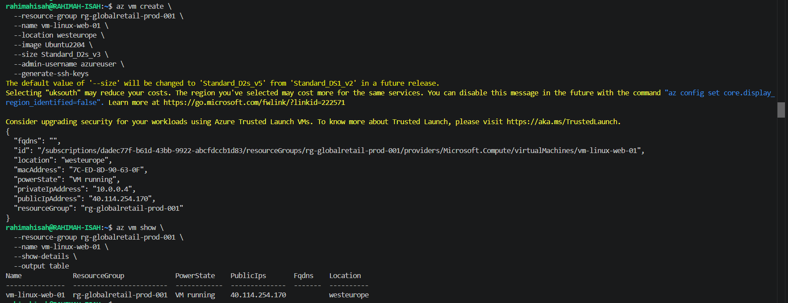

---

## Phase 3 — Windows Server Deployment

The Windows Server deployment initially failed because the VM name exceeded the Windows 15-character computer name limit.

After renaming the VM, Azure CLI returned a temporary `ResourceNotFound` message even though the deployment had completed successfully. The resource was verified before continuing.

### Windows VM Name Constraint


### Resource Verified After Deployment

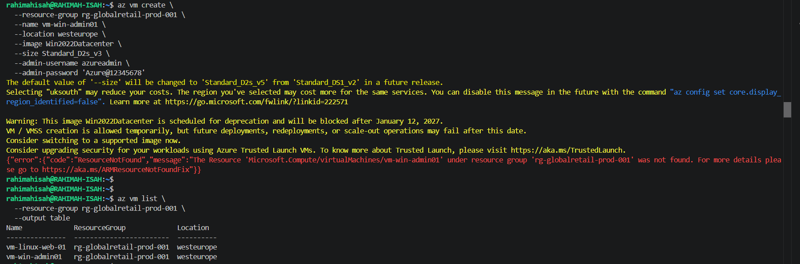

---

## Phase 4 — Windows 11 Client Deployment

The Windows 11 virtual machine initially failed because Azure attempted to create a default subnet that conflicted with the existing virtual network.

The existing subnet was identified and explicitly specified in the deployment command before the VM was successfully provisioned.

### Windows 11 Deployment Failed (Subnet Conflict)

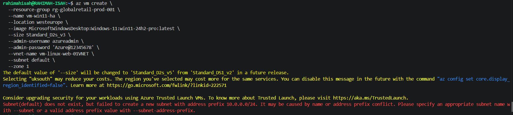

### Existing Subnet Verification

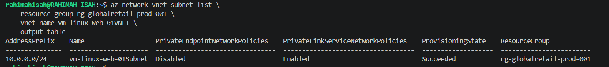

### Windows 11 Client VM Created

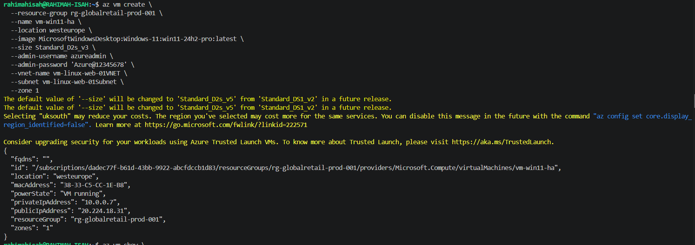

---

## Phase 5 — Linux Configuration

SSH authentication initially failed because the local workstation did not contain an SSH key pair.

A new RSA key pair was generated, the public key was associated with the VM, and a successful SSH connection was established.

After connecting to the VM:

- Package repositories were updated.
- Nginx was installed.
- The service was verified as running.

### SSH Permission Denied

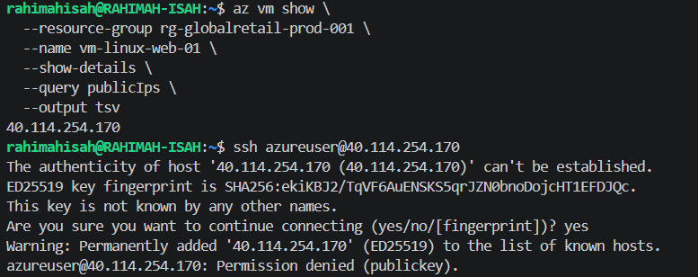

### Verify VM SSH Public Key

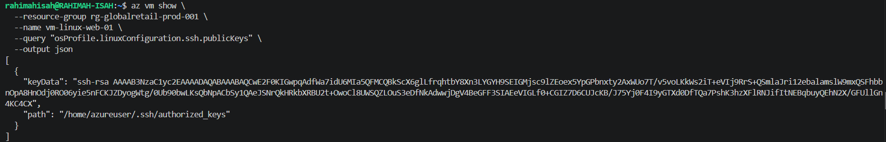

### Check Local SSH Directory

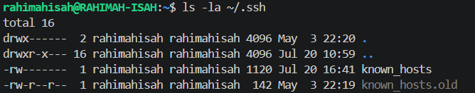

### Generate SSH Key Pair

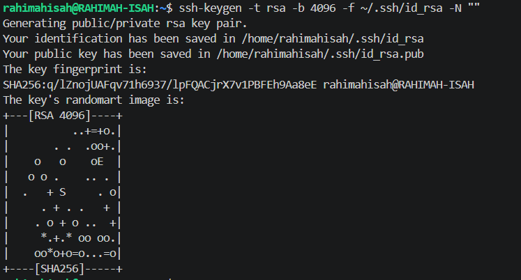

### Display Public SSH Key

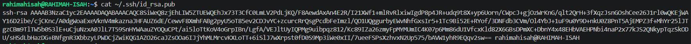

### Successful SSH Login

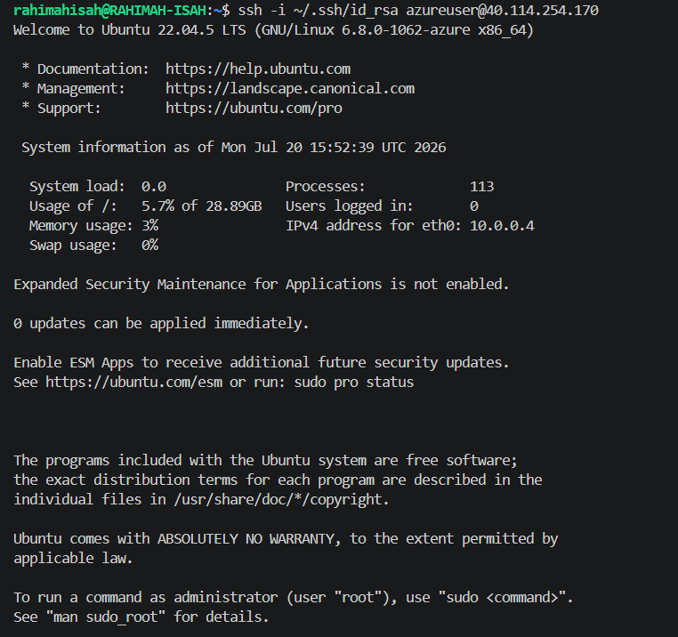

### Update Package Repository

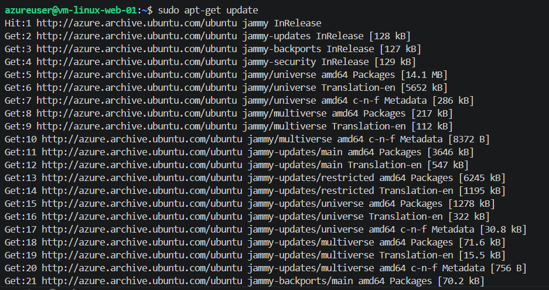

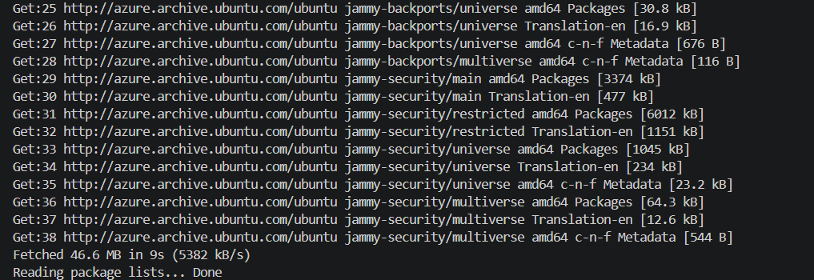

### Install Nginx

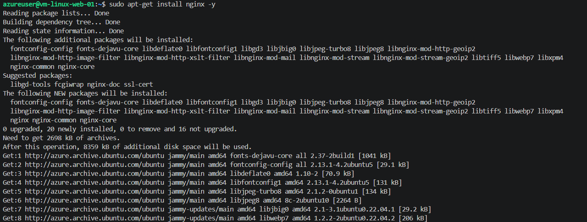

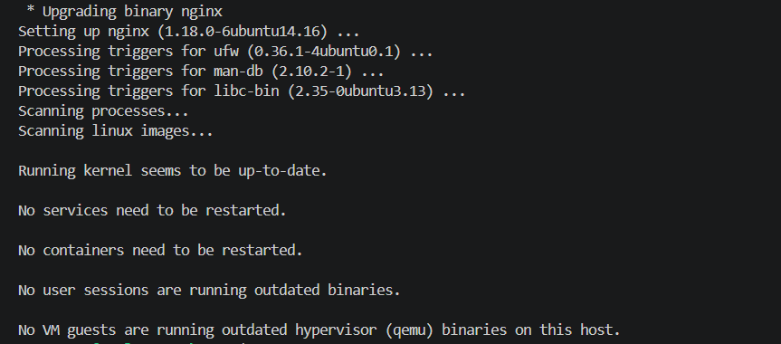

### Verify Nginx Service

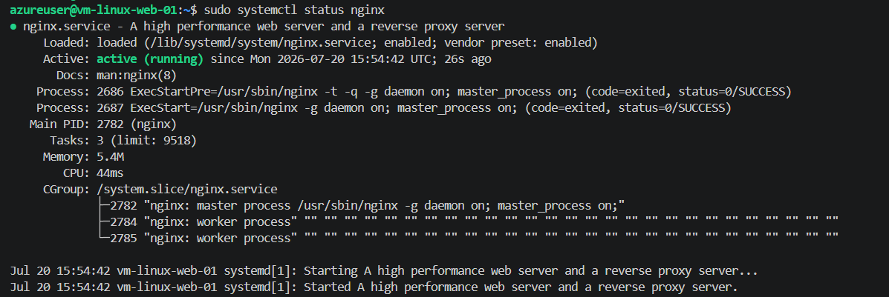

---

## Phase 6 — Windows Server Configuration

After connecting through Remote Desktop, Internet Information Services (IIS) was installed using Windows PowerShell.

### Install Internet Information Services (IIS)

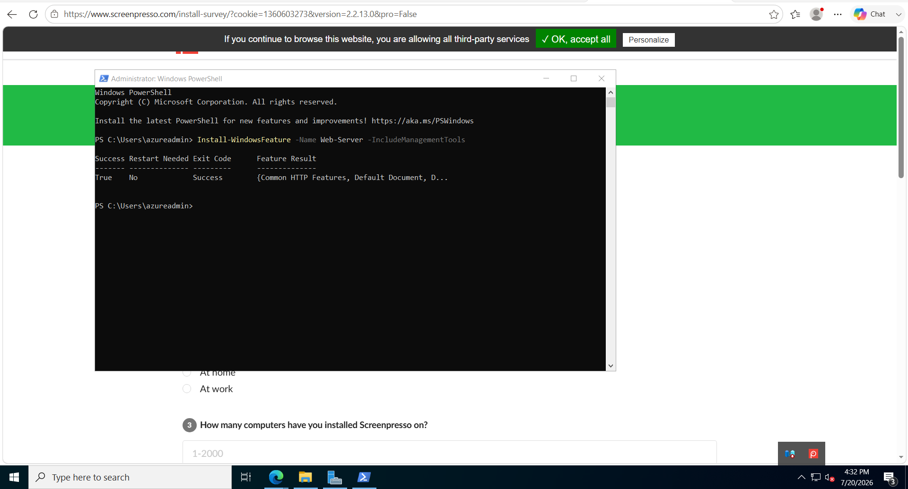
---

## Phase 7 — Network Security Configuration

Network Security Groups were reviewed before inbound HTTP rules were created to allow public access to both web servers.

### List Network Security Groups

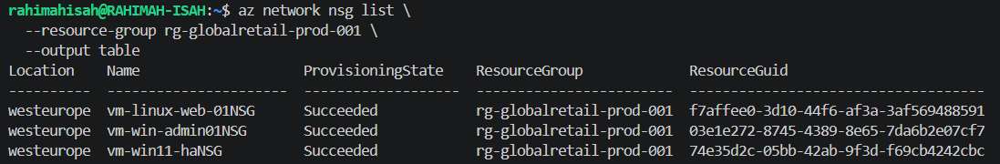

### Review Linux NSG Rules

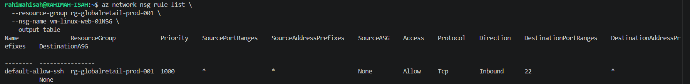

### Create HTTP Rule for Linux VM

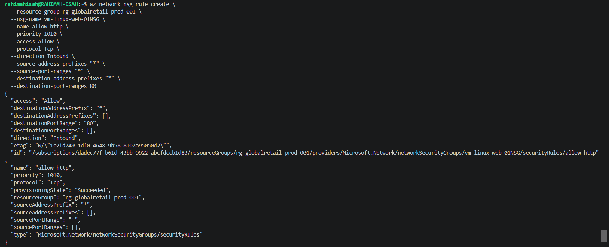

### Create HTTP Rule for Windows Server VM

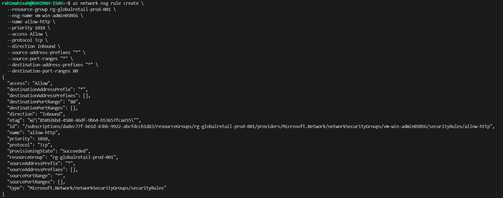

---

## Phase 8 — Public Connectivity Validation

Both web servers were successfully accessed from a web browser using their public IP addresses.

### Verify Nginx Public Access

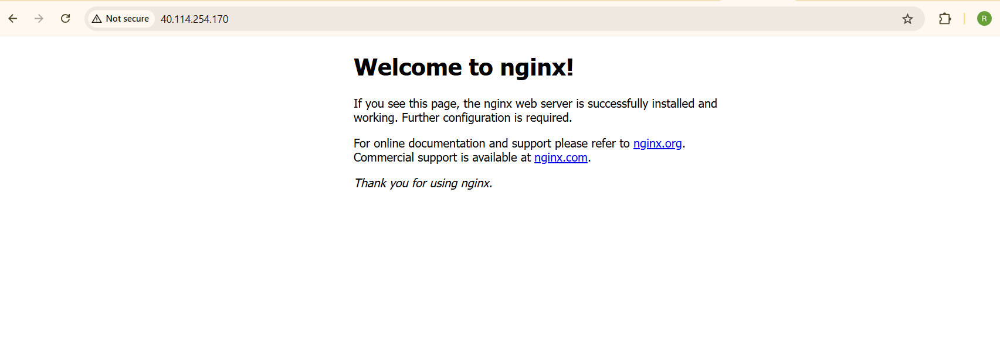

### Verify IIS Public Access

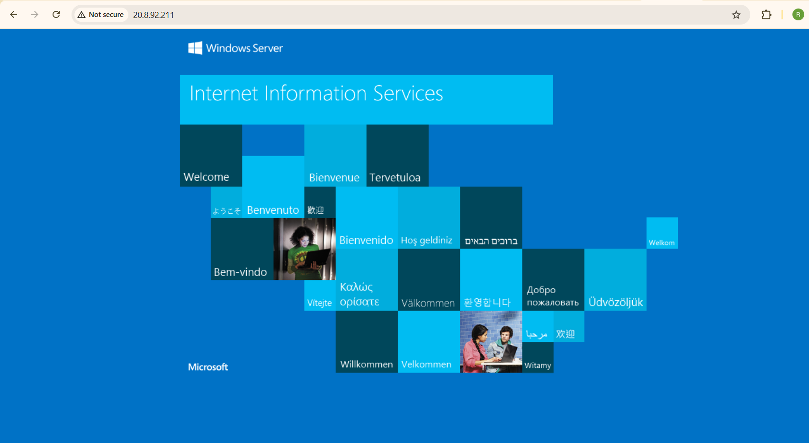

---

## Phase 9 — Resource Cleanup

After validation was completed, the Resource Group was deleted to prevent unnecessary Azure charges.

### Delete Resource Group


# Validation

The deployment was validated by confirming that:

- Ubuntu Linux VM accepted SSH connections using key-based authentication.
- Windows Server accepted Remote Desktop connections.
- Nginx service was running successfully.
- IIS was installed successfully.
- HTTP (TCP/80) traffic was permitted through the Network Security Groups.
- Both web servers were publicly accessible using their respective public IP addresses.
- All Azure resources were successfully removed after testing.

# Lessons Learned

This project reinforced several practical cloud engineering concepts:

- Validate Azure resources instead of relying solely on CLI responses.
- Windows virtual machines are subject to operating system naming constraints.
- Existing VNets and subnets should be reused explicitly during deployments.
- SSH authentication depends on both server-side authorization and client-side key management.
- Network Security Groups play a critical role in application accessibility.
- Automating deployments with Azure CLI improves repeatability and consistency.
- Deleting unused cloud resources is an essential cost management practice.

# Repository Structure

```text
globalretail-prod-lab/
│
├── README.md
├── docs/
│   └── project-notes.md
└── screenshots/
    ├── 01-project-structure.png
    ├── ...
    └── 30-delete-resource-group.png
```